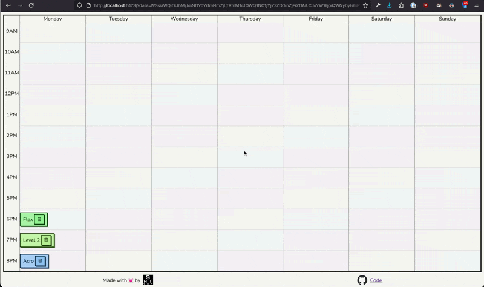

# Timetable

## Inspiration

I wanted to play around with drag and drop interfaces on the web, while also making a heavy client side application with [svelte](https://svelte.dev).

At the pole studio I go to I was also intrigued at how the manager and owner would plan the time table. It seemed it was all done by hand. This is an attempt to digitise this.

## Demo

## Notes

This is a simple hobby project that won't be worked on much, so the implementation may not be perfect (e.g. this might not work well on mobile).
